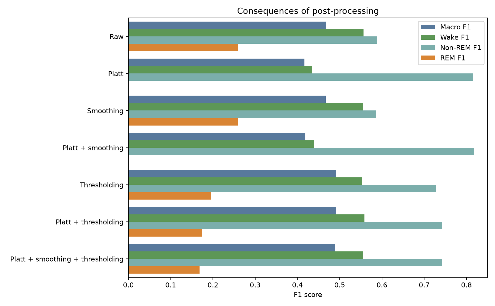
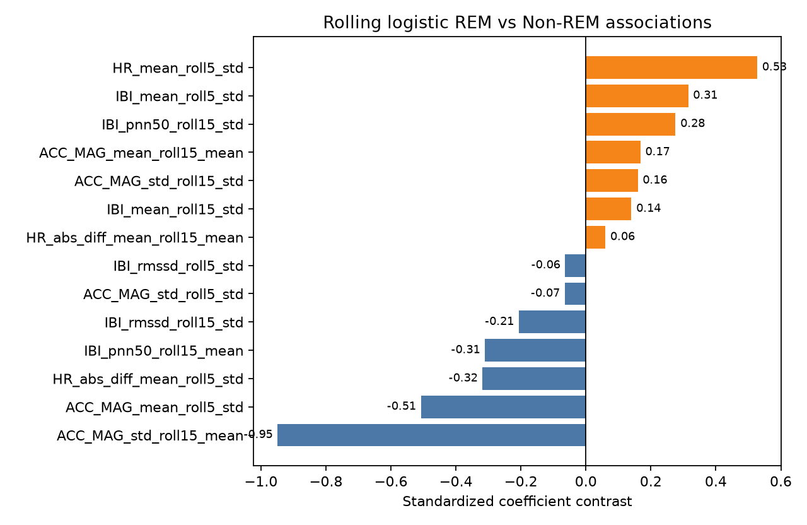
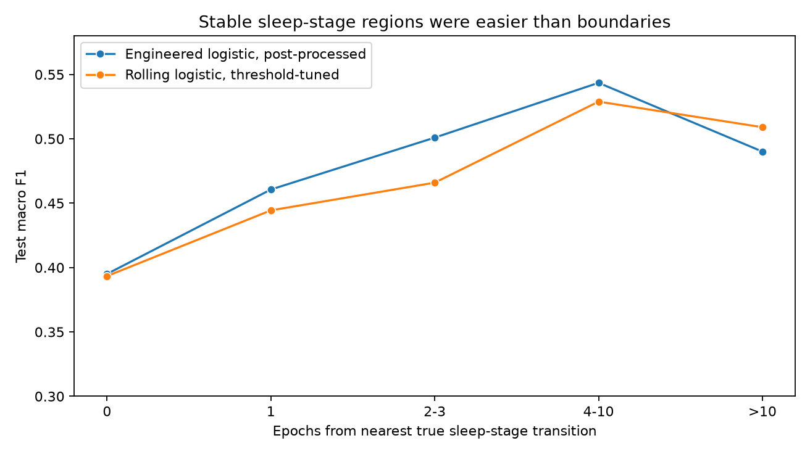

# Feature-Engineered Machine Learning for Wearable Sleep Staging

This repository extends the [`dreamt-wearable-sleep-staging`](https://github.com/manns79/dreamt-wearable-sleep-staging) project. Refer to the previous project's `README.md` for details about the DREAMT dataset. 

## Executive Summary

- **Research question:** Can classical ML with richer engineered wearable
  features match the previous deep-learning benchmark closely enough to offer a
  simpler and more interpretable alternative?
- **Task:** Three-class retrospective sleep staging on DREAMT wearable signals:
  `Wake`, `Non-REM`, and `REM`.
- **Evaluation design:** Fixed participant-level train/validation/test split
  reused from the earlier project, participant-grouped cross-validation on
  training participants, validation-only model selection, and one frozen
  held-out test evaluation.
- **Feature families:** Within-epoch statistical summaries, signal-specific
  physiological features, centered rolling temporal-context features, and
  whole-night participant-normalized features.
- **Model families:** Majority and stratified dummy baselines, elastic-net
  multinomial logistic regression, random forest, and XGBoost.
- **Best performing model:** Feature-engineered elastic-net logistic regression
  with train-OOF Platt calibration, probability smoothing, and class-threshold
  tuning reached **0.497** test macro F1.
- **Comparison to DL benchmark:** The previous project's transition-regularized
  61-epoch MSResCNN-MLP-TCN reached **0.501** test macro F1 on the same label
  mapping and participant-level split.
- **Interpretable model with comparable performance:** The pruned rolling elastic-net logistic
  model remained close to the best feature-engineered model after threshold
  tuning, **0.492** test macro F1, while exposing readable coefficient-level
  associations.

## Key Results

The table below summarizes model performance. Per-class F1 scores are reported on the held-out test set. The last row in this table, transition-regularized 61-epoch MSResCNN-MLP-TCN, is the best performing model from [`dreamt-wearable-sleep-staging`](https://github.com/manns79/dreamt-wearable-sleep-staging). The value shown in bold in each column denotes the highest obtained value of the corresponding F1 score.

| Model | Validation macro F1 | Test macro F1 | Wake F1 | Non-REM F1 | REM F1 |
| ----- | ------------------: | ------------: | ------: | ---------: | -----: |
| Majority-class baseline | 0.276 | 0.266 | 0.000 | **0.797** | 0.000 |
| Stratified-random baseline | 0.326 | 0.337 | 0.248 | 0.649 | 0.114 |
| Statistical-summary logistic, Platt + smoothing + thresholding | 0.438 | 0.445 | 0.542 | 0.689 | 0.105 |
| All engineered-feature logistic, Platt + smoothing + thresholding | **0.520** | 0.497 | 0.549 | 0.775 | 0.167 |
| Movement + cardiovascular rolling logistic, raw | 0.410 | 0.468 | 0.556 | 0.589 | **0.259** |
| Movement + cardiovascular rolling logistic, thresholding | 0.481 | 0.492 | 0.553 | 0.727 | 0.196 |
| transition-regularized 61-epoch MSResCNN-MLP-TCN | 0.510 | **0.501** | **0.564** | 0.793 | 0.146 |

Interpretation:
- The best performing traditional ML model, which used all feature and signal families, achieved performance comparable to the DL benchmark.
- After threshold tuning, an interpretable elastic-net logistic model that only used rolling context features from the movement and cardiovascular signal families also achieved performance comparable to the DL benchmark (see the next-to-last row).
- Generally, Platt scaling improved probability calibration but not necessarily macro F1; probability smoothing had little to no effect; and per-class threshold tuning improved performance by reducing overprediction of REM.  


Using the interpretable elastic-net logistic model, the figure below further illustrates the consequences of the different post-processing techniques used.




## Main Scientific Findings

### REM Remained The Central Failure Mode

REM was difficult even though the test split contained 1,318 REM epochs. Low
participant-level support still matters: participant `S081` had zero REM epochs
and `S050` had only 12. Their participant-level REM metrics are therefore
unstable or undefined in a practical sense, but the global REM weakness cannot
be dismissed as a support artifact.

The raw rolling logistic model's REM error analysis makes the limitation clear:
it correctly identified 708 REM epochs, but also predicted REM for 3,038 true
`Non-REM` epochs and 407 true `Wake` epochs. The wearable features carried REM
signal, but they did not cleanly separate REM from quiet `Non-REM`.

## Analysis of the Intepretable Logistic Model

One of the main motivations for exploring simpler ML sleep-staging models in this project was to make the scientific implications clearer. Thus, with the goal of eliminating as much unnecessary complexity as possible, a logistic model was constructed based on the hypotheses:
1. the movement signal family helps distinguish `Wake` from `Sleep`;
2. the cardiovascular signal family helps distinguish `Non-REM` from `REM`; and 
3. temporal-context features align well with the sequential nature of sleep.

To further simplify this logistic model, the training data was used to compute correlations between candidate features, then a deterministic rule was used to eliminate redundancies. The result was a logistic model that used 25 temporal-context features from the cardiovascular and movement signal families. As demonstrated by the key results, the performance of this model was comparable to the DL benchmark.


### Coefficient-Level Interpretation

Coefficients of the interpretable logistic model were analyzed to try to shed light on the scientific implications. The strongest coefficient contrasts were temporal-context features from the movement family, especially `ACC_MAG_std_roll15_mean`:

- `REM` vs `Non-REM`: -0.949
- `Wake` vs `Non-REM`: +0.767
- `REM` vs `Wake`: -1.716

As one expects based on intuition, this suggests that sustained movement variability pushes the model towards `Wake`, while less movement variability pushes the model towards sleep  states.

Temporal-context features from the cardiovascular family contributed to `REM` versus `Non-REM` separation. Positive `REM` contrasts included `HR_mean_roll5_std` (+0.527), `IBI_mean_roll5_std` (+0.315), and `IBI_pnn50_roll15_std` (+0.276). On the other hand, `IBI_pnn50_roll15_mean` pushed away from both `Wake` and `REM` toward `Non-REM`, consistent with the model using sustained HRV-like context as a Non-REM signal.

The figure below illustrates coefficient contrasts between `REM` and `Non-REM`.



### REM Error Interpretation

The raw rolling model often treated quiet `Non-REM` as REM. For example,
`ACC_MAG_std_roll15_mean` was almost identical for true REM predicted REM
(0.2975) and true `Non-REM` predicted REM (0.2990), while non-REM-related rows
had a much higher mean value (0.8217). This supports a conservative conclusion:
rolling wearable features contain REM-relevant information, but quiet `Non-REM`
can look REM-like in this feature space.

## Validation Ablation Findings

The first set of ablation experiments focused on feature families: within-epoch statistical summaries, signal-specific physiological features, centered rolling temporal-context features, and whole-night participant-normalized features. These signal families were added sequentially to each model family. As illustrated by the figure below, results indicate that temporal-context features carry the most information.

The second set of ablation experiments focused on signal groups: movement, cardiovascular, electrodermal, and skin temperature. Each model family used a single signal group for prediction, then the experiment iterated through the different signal groups. The results, summarized by the figure below, suggest that movement and cardiovascular signals are the most predictive. 

## End-To-End Workflow

The repository implements an end-to-end applied ML workflow:

1. data validation and PSG epoch construction;
2. modular physiological feature engineering;
3. participant-grouped model tuning;
4. feature-family and signal-group ablations;
5. interpretable rolling-feature selection;
6. calibration, threshold, smoothing, and sequence post-processing experiments;
7. frozen held-out test evaluation;
8. transition, participant-level, and REM-focused failure analysis;
9. curated result artifacts.

## Repository Structure

```text
feature-engineered-wearable-sleep-staging/
  README.md
  pyproject.toml
  data/
    README.md
    raw/          # local DREAMT files; ignored
    interim/      # split assignments and epoch indexes
    processed/    # generated feature tables; ignored
  docs/
    final_test_protocol.md
  notebooks/
    01_data_exploration.ipynb
    02_feature_exploration.ipynb
    03_validation_error_analysis.ipynb
    04_locked_test_evaluation.ipynb
  results/
    summary/      # compact tracked metrics
    figures/      # README figures
  scripts/
  src/
    data/
    features/
    models/
    visualization/
  tests/
```

Raw DREAMT files, generated feature tables, per-epoch predictions, trained
models, and large run outputs are not committed.

## Reproducibility

Set up the environment:

```bash
python3 -m venv .venv
source .venv/bin/activate
python -m pip install -e ".[dev,interpretability,notebooks]"
```

Run tests and linting:

```bash
pytest
ruff check .
```

Prepare local data and splits:

```bash
python scripts/copy_previous_split.py
python scripts/build_epoch_index.py
python scripts/build_features.py
```

`scripts/copy_previous_split.py` reuses the fixed split assignments from the previous project. If the [`dreamt-wearable-sleep-staging`](https://github.com/manns79/dreamt-wearable-sleep-staging) repository is not adjacent to this one, pass the appropriate source path to the script or place a compatible `data/interim/split_assignments.csv` file locally.

Run the main validation-stage experiments:

```bash
python scripts/run_ablation_experiments.py --run-id full_ablation_YYYYMMDD
python scripts/run_validation_error_analysis.py \
  --run-dir outputs/runs/full_ablation_YYYYMMDD
python scripts/run_rolling_logistic_experiment.py \
  --run-id rolling_logistic_train_oof_postprocessed_YYYYMMDD
```

Run the final-test evaluation and analysis of the interpretable logistic model:

```bash
python scripts/run_final_test_evaluation.py
python scripts/run_rolling_logistic_interpretation.py
```

## Limitations

- Movement features help separate `Wake` from sleep states; however, as illustrated below using the interpretable logistic model, "quiet" `Non-REM` is often treated as `REM`.
  and thresholding.
- Model performance declines near sleep-stage transitions. 



- `REM` support (i.e., the number of `REM` epochs) is very low for certain participants, which makes participant-level performance difficult to assess. 

## Future work

- Given the relative success of disinguishing `Wake` from `Non-REM` and `REM`, hierarchical modeling may improve performance on sleep states.
- Results suggest that temporal-context, movement signals, and cardiovascular signals are informative; however, verifying these conclusions on datasets other than DREAMT would strengthen results. 
- To help assess whether additional complexity earns its keep in this problem, quantify the difference in training time between traditional ML and DL models.
